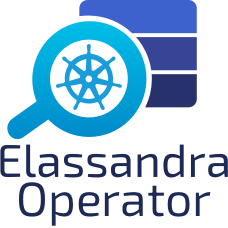

# Elassandra Operator [](https://travis-ci.com/strapdata/elassandra-operator) [](https://github.com/strapdata/elassandra-operator/releases/latest) [](https://twitter.com/strapdataio)



The Elassandra Kubernetes Operator automates the deployment and management of [Elassandra](https://github.com/strapdata/elassandra) 
clusters deployed in multiple [Kubernetes](https://kubernetes.io/) clusters. By reducing the complexity of running a Cassandra or 
Elassandra clusters under Kubernetes, it gives you the flexibility to migrate your data to any Kubernetes cluster with 
no downtime and the freedom to choose your cloud provider or run on-premise.

## Features

Elassandra Operator features:

* Manage one [Kubernetes StatefulSet](https://kubernetes.io/docs/concepts/workloads/controllers/statefulset/) per Cassandra rack to ensure data consistency across availability zones.
* Manage multiple Elassandra/Cassandra datacenters in the same or different Kubernetes clusters, in one or multiple namespaces.
* Manage rolling configuration changes, rolling upgrade/downgrade of Elassandra, rolling restarts.
* Scale up/down Elassandra datacenters.
* Park/Unpark Elassandra datacenters (and associated Kibana and Cassandra Reaper instances).
* Implements Elassandra tasks to add/remove datacenters from an Elassandra cluster.
* Deploy [Cassandra Reaper](http://cassandra-reaper.io/) and register keyspaces to run continuous Cassandra repairs.
* Deploy multiple [Kibana](<https://www.elastic.co/fr/products/kibana>) instances with a dedicated Elasticsearch index in Elassandra.
* Expose Elassandra metrics for the [Prometheus Operator](https://prometheus.io/docs/prometheus/latest/querying/operators/).
* Publish DNS names of Elassandra broadcast IP addresses using [ExternalDNS](https://github.com/kubernetes-sigs/external-dns).
* Automatically generates SSL/TLS certificates and strong passwords stored as Kubernetes secrets.
* Create Cassandra roles and automatically grants the desired permissions on Cassandra keyspaces.
* Automatically adjust the Cassandra Replication Factor for managed keyspaces, repair and cleanup after scale up/down.
* Provide a java [AddressTranslator](https://docs.datastax.com/en/developer/java-driver/3.6/manual/address_resolution/) for the Cassandra driver allowing to run applications in the same Kubernetes cluster as the Elassandra datacenter (similar to the [EC2MultiRegionAddressTranslator](https://docs.datastax.com/en/drivers/java/3.7/index.html?com/datastax/driver/core/policies/EC2MultiRegionAddressTranslator.html) but for any Kubernetes cluster).

## Status

Elassandra Operator version 0.1 is currently Alpha.

* Docker images are available on [dockerhub](https://hub.docker.com/repository/docker/strapdata/elassandra-operator).
* HELM charts are available at [https://charts.strapdata.com](https://github.com/strapdata/helm-charts)

## Documentation

* Please see the [Elassandra-Operator documentation](https://operator.elassandra.io).
* Quickstart is available [here](http://operator.elassandra.io/quickstart.html)

## Minimum Requirements

- Kubernetes cluster, 1.15 or newer.
- HELM 2

## Support

 * Commercial support is available through [Strapdata](http://www.strapdata.com/).
 * Community support available via [Elassandra Google Groups](https://groups.google.com/forum/#!forum/elassandra).
 * Post feature requests and bugs on https://github.com/strapdata/elassandra-operator/issues

## Contributing

The Elassandra-Operator is licensed under AGPL and you can contribute to bug reports,
documentation updates, tests, and features by submitting github issues or/and pull requests as usual.

### General design

The Elassandra Operator rely on the [Micronaut framework](https://micronaut.io/) and the 
[Kubernetes java client](https://github.com/kubernetes-client/java) in a reactive programming style.
It does not require any Cassandra/Elassandra sidecar container, but requires a dedicated Elassandra docker image 
that warps the docker entrypoint for customization purposes.

### Developer setup

Requirements:
* Java 8
* Docker
* HELM 2
* Kind (for kubernetes tests)

### Build from source

Publish the docker images (operator + elassandra + cassandra reaper):
```bash
./gradlew dockerPush -PregistryUsername=$DOCKER_USERNAME -PregistryPassword=$DOCKER_PASSWORD -PregistryUrl=$REGISTRY_URL
```

Publish in local insecure registry:
```bash
./gradlew dockerPush -PregistryUrl="localhost:5000" -PregistryInsecure
```

Build parameters are located in `gradle.properties`.

### Run

You can deploy the Elassandra-Operator into your Kubernetes cluster as a single pod deployment (see the HELM chart), 
or run it outside the Kubernetes cluster, mainly for dev purposes:
```bash
./gradlew runLocal
```

When running outside the Kubernetes cluster, webhook validation is not possible, and the operator listen
for incoming HTTP connections on port 8080 (see the java/operator/gradle.build).

### Integration Tests

We uses [TravisCI](.travis.yml) to build and run automated integration tests on [Kind](https://kind.sigs.k8s.io/docs/user/quick-start/).
You can also run these [integration tests](integ-test) on GKE or AKS.

Setup test cluster using [Kind](https://kind.sigs.k8s.io/docs/user/quick-start/):

```
integ-test/setup-cluster.sh
integ-test/install_elassandra_operator.sh
```

Run integration tests:

```
integ-test/test-admission.sh
integ-test/test-hostnetwork.sh
integ-test/test-reaper-registration.sh
integ-test/test-scaleup-park-unpark.sh
integ-test/test-multiple-dc-1ns.sh
integ-test/test-multiple-dc-2ns.sh
integ-test/test-rolling-upgrade.sh
integ-test/test-replace-pvc.sh
```

## License

Copyright (C) 2020 Strapdata SAS (support@strapdata.com)

The Elassandra-Operator is free software: you can redistribute it and/or modify
it under the terms of the GNU Affero General Public License as published by
the Free Software Foundation, either version 3 of the License, or
(at your option) any later version.

The Elassandra-Operator is distributed in the hope that it will be useful,
but WITHOUT ANY WARRANTY; without even the implied warranty of
MERCHANTABILITY or FITNESS FOR A PARTICULAR PURPOSE.  See the
GNU General Public License for more details.

You should have received a copy of the GNU General Public License
along with the Elassandra-Operator.  If not, see <http://www.gnu.org/licenses/>.

## Acknowledgments

* Kubernetes is a trademark of THE LINUX FOUNDATION
* Elasticsearch, Logstash, Beats and Kibana are trademarks of Elasticsearch BV, registered in the U.S. and in other countries.
* Apache Cassandra, Apache Lucene, Apache, Lucene and Cassandra are trademarks of the Apache Software Foundation.
* Elassandra is a trademark of Strapdata SAS.