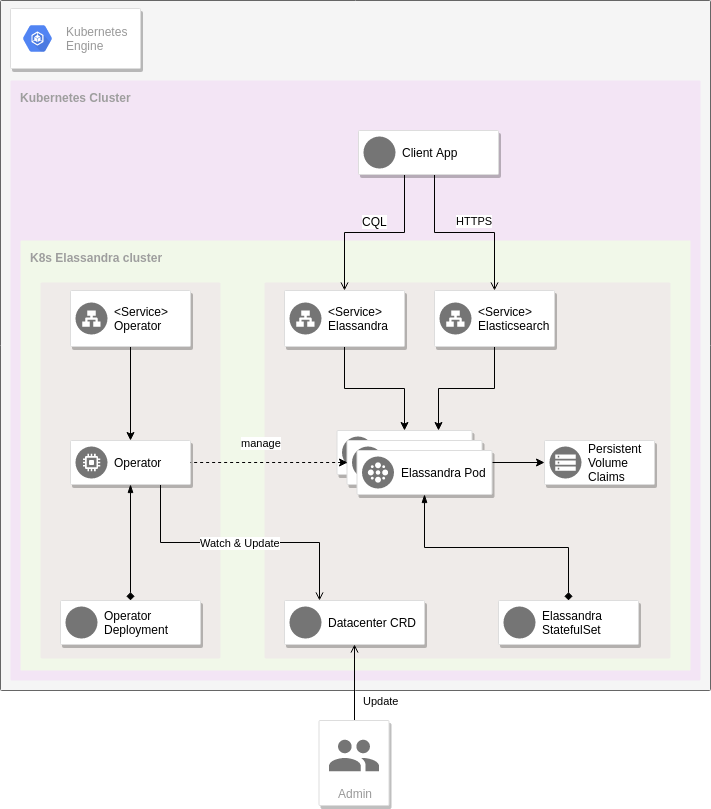

Architecture
------------

This section introduces the main components in actions when Elassandra is deployed and managed by the Elassandra Operator.

High Availibility
.................

Elassandra high availibilty across cloud-provider zones is achieve by using one StatfulSet per Cassandra rack.

Elassandra operator
...................

The Elassandra Operator is responsible to maintain the consistency of the Elassandra datacenter state based on the configuration declared into the DataCenter CRD.
To do so, the operator watches the kubernetes resources and react on event (Pod is now running, ConfigMap changed...).
Based on the Elassandra Datacenter definition, the operator will determine if an action is required base on the even.

Elassandra Datacenter
.....................

The Elassandra Datacenter CRD is the first class resource in the architecture. This CRD contains the information used by the operator to manage the Elassandra nodes.
This CRD describes:

* the number of elassandra nodes
* the versions of docker images deployed by the operator
* the resources provided to Elassandra node (CPU, RAM, Storage)
* Elassandra listening ports
* etc.

The CRD also provide a status section in order to check easily the state of the Elassandra Datacenter.

Elassandra Pod
..................

Elassandra pod contains two containers, the *Elassandra Node* and the *Elassandra Sidecar*

Elassandra node
^^^^^^^^^^^^^^^

Elassandra node is an Elassandra Enterprise with some extensions to be managed by the Elassandra Operator.

Elassandra sidecar
^^^^^^^^^^^^^^^^^^

The Elassandra sidecar is a companion container to the Elassandra node. This container expose administration actions to the Operator like :

* perform a node backup
* return the Elassandra node status
* enable/disable the search capability of a node

Continous Cassandra repair
..........................

In order to ensure data consistency, a continuous cassandra repair may be scheduled by a `Cassandra Reaper <https://http://cassandra-reaper.io/>`_ deamon running on each datacenter:
Credentials to connect to Reaper are available in the secrets generated by the operator.

.. code-block:: bash

    kubectl get secrets -o yaml -n default elassandra-${CLUSTER_NAME}-${DATACENTER_NAME}-reaper | grep "admin_password:" | cut -f2 -d':' | tr -d ' ' | base64 -d

