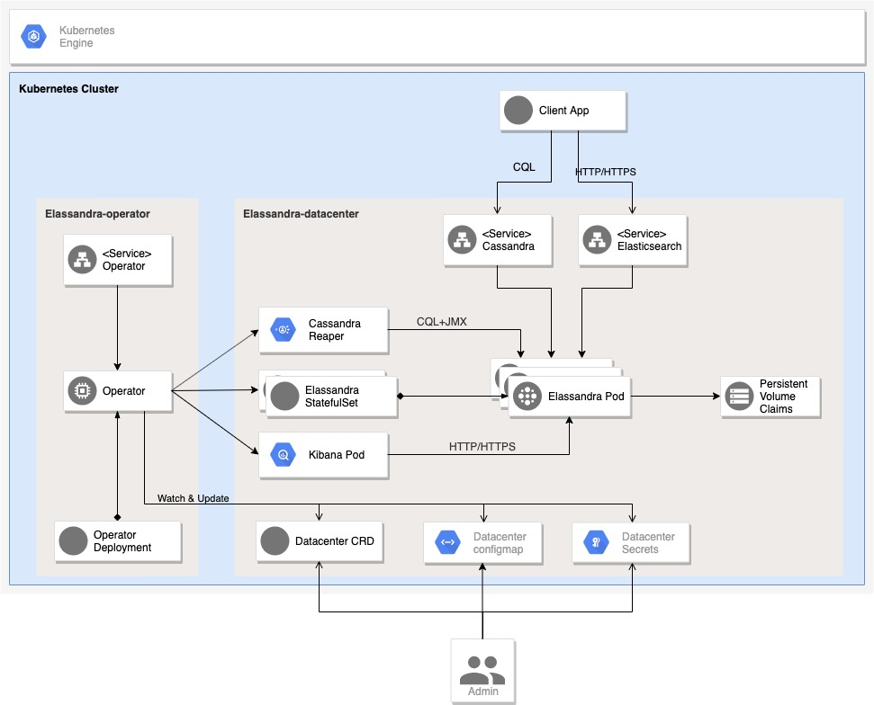
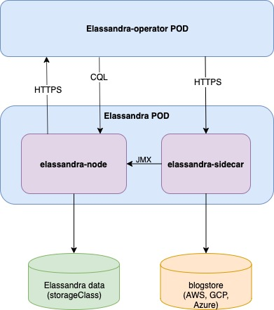

Elassandra-Operator
===================

The Elassandra Operator automates the deployment and management of Elassandra datacenters in Kubernetes clusters.
By reducing the complexity of running a Cassandra/Elassandra cluster, the Elassandra operator lets you focus on the desired configuration.

Elassandra Operator features:

  * `Kubernetes StatefulSet <https://kubernetes.io/docs/concepts/workloads/controllers/statefulset/>`_ per Cassandra rack to ensure data consistency across cloud-provider availability zones.
  * Manage mutliple Cassandra datacenters in the same or different Kubernetes clusters.
  * Manage rolling configuration changes, rolling upgrade/downgrade of Elassandra, scale up/down Elassandra datacenters.
  * Deploy `Cassandra Reaper <https://cassandra-reaper.io/>`_ to run continuous Cassandra repairs.
  * Deploy multiple `Kibana <https://www.elastic.co/fr/products/kibana>`_ instances with a dedicated Elasticserach index in Elassandra.
  * Park/Unpark Elassandra datacenters (and associated Kibana and Cassandra Reaper instances).
  * Expose Elassandra metrics for the `Prometheus Operator <https://prometheus.io/docs/prometheus/latest/querying/operators/>`_.
  * Publish public DNS names allowing Elassandra nodes to be reachable from the internet (Cassandra CQL and Elasticsearch REST API).
  * Automatically generates SSL/TLS certificates and strong passwords stored as Kubernetes secrets.
  * Create Cassandra roles and automatically grants the desired permissions on Cassandra keyspaces.
  * Automatically adjust the Cassandra Replication Factor for managed keyspaces, repair and cleanup after scale up/down the datacenter.

Requirements
------------

* Kubernetes cluster 1.15 or newer.
* Kubernetes nodes must be properly synchronized with NTP.
* `ExternalDNS <https://github.com/kubernetes-sigs/external-dns>`_ to expose Elassandra datacenters to the internet world.
* `Prometheus-Operator <https://github.com/coreos/prometheus-operator>`_ to monitor your the Elassandra operator and Elassandra cluster.
* A Kubernetes `Ingress Controller <https://kubernetes.io/docs/concepts/services-networking/ingress-controllers/>`_ to expose Kibana, Cassandra Reaper user interface.

How It works
------------

The Elassandra Operator extends the Kubernetes API by creating a Custom Resource Definition (CRD) defining a Cassandra/Elassandra datacenter
and creates a Kubernetes StatefulSet per Cassandra availability zone identified by the kubernetes label ``failure-domain.beta.kubernetes.io/zone``.

The Elassandra Operator can also deploy :
* One Cassandra Reaper pod per datacenter to achieve continuous Cassandra repair.
* Many Kibana deployment allowing to visualize data indexed in Elasticsearch.

Once Elassandra pods are deployed and running, the Elassandra operator interacts with the Elassandra nodes through JMX, CQLSH and HTTP
to execute administrative tasks like Cassandra repair, cleanup or setup continous repairs.
It also interact directly with the Elassandra container to properly manage keyspace replication factor and deploy Cassandra roles and associated permissions.

Quick Start
-----------

Add the strapdata HELM repository

.. code::

    helm repo add strapdata https://charts.strapdata.com

Update the strapdata HELM repository

.. code::

    helm repo update

Deploy the Elassandra operator in the default namespace:

.. code::

    helm install --namespace default --name strapkop --wait strapdata/elassandra-operator

Deploy an Elassandra Datacenter in a dedicated namespace **ns1** with 1 replica:

.. code::

    helm install --namespace "ns1" --name "ns1-cl1-dc1" --set replicas=1 --wait strapdata/elassandra-datacenter

.. note:

    * To avoid mistakes, HELM release name MUST include the cluster name and datacenter name separated by a dash.
    * The default storageclass is **standard**, but your can use any available storageclass.
    * Cassandra reaper, Elasticsearch and Kibana are enable by default.

Check Elassandra pods status:

.. code::

    kubectl get pod -n ns1

Check the Elassandra DataCenter status:

.. code::

    kubectl get edc elassandra-cl1-dc1 -o yaml

List Elassandra datacenter secrets:

.. code::

    kubectl get secret -n ns1

Connect to a Cassandra node:

.. code::

    kubecrtl exec -it elassandra-cl1-dc1-0-0 -- bash -l

Connect to Kibana using port-forwarding:

.. code::

    kubectl port-forward pod/kibana 5601:5601

Alternatively, you can setup an ingress controller for the kibana instance.

Watch the Elassandra Datacenter CRD status until it is green, meaning all pods are up and running:

.. code::

    edctl watch-dc -n elassandra-cl1-dc1 -ns $NS --health GREEN

Resources configuration
_______________________

You can adjust CPU and Memory needs of your Elassandra nodes by updating the CRD elassandradatacenter as shown here:

.. code::

    kubectl patch elassandradatacenter elassandra-cl1-dc1 --type merge --patch '{"spec":{"resources":{"limits":{"memory":"4Gi"}}}}'

Resources entry may receive "limits" and/or "requests" quantity description as describe in the `k8s documentation <https://kubernetes.io/docs/concepts/configuration/manage-compute-resources-container/>`_.

.. code::

    resources:
      requests:
        cpu: 500m
        memory: 1Gi
      limits:
        cpu: 1000m
        memory: 2Gi

Pod affinity
____________

You can define the `NodeAffinity <https://kubernetes.io/docs/concepts/configuration/assign-pod-node/#node-affinity>`_
for the Elassandra pods using the ``nodeAffinityPolicy`` attribute of the DatacenterSpec. Possible values are :

* STRICT : schedule elassandra pods only on nodes in the matching the ``failure-domain.beta.kubernetes.io/zone`` label (default value)
* SLACK : schedule elassandra pods preferably on nodes in the matching the ``failure-domain.beta.kubernetes.io/zone`` label

Of course, when ``hostNetwork`` or ``hostPort`` is enabled (see Networking), using the SLACK affinity is not possible because all Elassandra nodes
of a cluster listen on the same TCP ports.

Peristent Storage
-----------------

Elassandra nodes require persistent volumes to store Cassandra and Elasticsearch data.
You can use various kubernetes storage class including local and attached volumes.
Usage of SSD disks is recommended for better performances.

Persistent volume attached to availability zones
________________________________________________

The Elassandra operator deploys one Cassandra rack per availability zone to ensure data consistency when a zone is unavailable.
Each Cassandra rack is a Kubernetes StatefulSet, and rack names are Kubernetes node label ``failure-domain.beta.kubernetes.io/zone``.

In order to create Persistent Volume in the same availability zone as the StatefulSet,
you may create storage classes bound to availability zones of your cloud provider, as shown bellow using SSDs in GKE:

.. code::

    apiVersion: storage.k8s.io/v1
    kind: StorageClass
    metadata:
      name: ssd-europe-west1-b
      labels:
        addonmanager.kubernetes.io/mode: EnsureExists
        kubernetes.io/cluster-service: "true"
    provisioner: kubernetes.io/gce-pd
    parameters:
      type: pd-ssd
    allowVolumeExpansion: true
    reclaimPolicy: Delete
    volumeBindingMode: Immediate
    allowedTopologies:
      - matchLabelExpressions:
          - key: failure-domain.beta.kubernetes.io/zone
            values:
              - europe-west1-b

In the Elassandra datacenter spec, you can then specify a ``storageClassName`` ìncluding a **{zone}** variable replaced
by the corresponding availability zone name.

.. code::

    dataVolumeClaim:
      accessModes:
        - ReadWriteOnce
      storageClassName: "ssd-{zone}"
      resources:
        requests:
          storage: 128Gi

Peristent Volume decommission policy
____________________________________

By default, Elassandra nodes PVC are deleted when deleting an Elassandra datacenter, but you can keep PVCs with the following setting:

.. code::

    decommissionPolicy: KEEP_PVC

Network Configuration
---------------------

The Elassandra Operator can deploy datacenters in 3 networking configuration controlled by the following datacenter spec block:

.. code::

    networking:
      hostPortEnabled: false
      hostNetworkEnabled: false

In-cluster networking
_____________________

This is the default networking configuration where Cassandra and Elasticsearch pods listen on PODs private IP addresses.
In such configuration, Elassandra pods can only be reached by applications deployed in the same Kubernetes cluster through a headless service.

Out-of-cluster Networking with private IP addressing
____________________________________________________

In this configuration, Elassandra pods should be deployed with kubernetes ``hostPort`` enabled to allow the inbound traffic
on Elassandra ports (Cassandra Native and Storage, Elasticsearch HTTP/HTTPS port) from the outside of the Kubernetes cluster.

This allows Elassandra pod to bind and broadcast Kubernetes node private IP address to interconnect datacenters through VPN or PVC.

Out-of-cluster Networking with Public IP addressing
___________________________________________________

In this configuration, Elassandra pods broadcast a public IP should be deployed with ``hostNetwork`` enabled, allowing Elassandra pods
to bind and broadcast public IP address of their Kubernetes nodes. In such configuration, cross datacenter connection
can rely on public IP a``dresses without the need of a VPN or a VPC.

Security
--------

Kuberenetes RBAC
________________

The elassandra operator runs with a dedicated Kubernetes serviceaccount ``elassandra-operator`` and a
cluster role ``elassandra-operator`` with the following restricted operations:

.. code::

    apiVersion: rbac.authorization.k8s.io/v1
    kind: ClusterRole
    metadata:
      creationTimestamp: "2019-10-17T22:55:19Z"
      labels:
        app: elassandra-operator
        chart: elassandra-operator-0.1.0
        heritage: Tiller
        release: strapkop
      name: elassandra-operator
      resourceVersion: "5345657"
      selfLink: /apis/rbac.authorization.k8s.io/v1/clusterroles/elassandra-operator
      uid: 311e5250-f131-11e9-a4ec-82615f3d8479
    rules:
    - apiGroups:
      - extensions
      resources:
      - thirdpartyresources
      verbs:
      - '*'
    - apiGroups:
      - apiextensions.k8s.io
      resources:
      - customresourcedefinitions
      verbs:
      - '*'
    - apiGroups:
      - elassandra.strapdata.com
      resources:
      - elassandradatacenter
      - elassandradatacenters
      - elassandradatacenter/status
      - elassandradatacenters/status
      - elassandratask
      - elassandratasks
      - elassandratask/status
      - elassandratasks/status
      verbs:
      - '*'
    - apiGroups:
      - apps
      resources:
      - statefulsets
      - deployments
      verbs:
      - '*'
    - apiGroups:
      - ""
      resources:
      - configmaps
      - secrets
      verbs:
      - '*'
    - apiGroups:
      - ""
      resources:
      - pods
      verbs:
      - list
      - delete
    - apiGroups:
      - ""
      resources:
      - services
      - endpoints
      - persistentvolumeclaims
      - persistentvolumes
      - ingresses
      verbs:
      - get
      - create
      - update
      - delete
      - list
    - nonResourceURLs:
      - /version
      - /version/*
      verbs:
      - get
    - apiGroups:
      - ""
      resources:
      - nodes
      verbs:
      - list
      - watch
    - apiGroups:
      - ""
      resources:
      - namespaces
      verbs:
      - list

When Kubernetes ``hostNetwork`` or ``hostPort`` is enabled (see Networking), the Elassandra operator adds an init container
named **nodeinfo** allowing the Elassandra pods to get the node public IP address.

In order to access Kubernetes these nodes information, the Elassandra Operator HELM chart creates a dedicated ServiceAccount
suffixed by ``nodeinfo`` associated to the ClusterRole ``node-reader`` with the following permissions:

.. code::

    apiVersion: rbac.authorization.k8s.io/v1
    kind: ClusterRole
    metadata:
      labels:
        app: {{ template "elassandra-operator.name" . }}
        chart: {{ .Chart.Name }}-{{ .Chart.Version }}
        heritage: {{ .Release.Service }}
        release: {{ .Release.Name }}
      name: {{ template "elassandra-operator.fullname" . }}-node-reader
    rules:
      - apiGroups: [""]
        resources: ["nodes"]
        verbs: ["get", "list", "watch"]
      - apiGroups: [""]
        resources: ["pods"]
        verbs: ["get", "list", "watch"]

Certificate management
______________________

In order to dynamically generates X509 certificates, the Elassandra-Operator use a root CA certificate and private key stored as
Kubernetes secrets. If theses CA secrets does not exist in the namespace where the datacenter is deployed, the operator automatically generates
a self-signed root CA certificate in that namespace:

* Secret **ca-pub** contains the root CA certificate as a PEM file and PKCS12 keystore. (respectively named *cacert.pem* and *truststore.p12*)
* Secret **ca-key** contains the root CA private key in a PKCS12 keystore. (named *ca.key*)

SSL/TLS Certificates
____________________

When an Elassandra datacenter is deployed, a SSL/TLS keystore is generated from the namespaced root CA certificate if it does not exists in the secret
``elassandra-[clusterName]-[dcName]-keystore``. This certificate has a wildcard certificate subjectAltName extension matching all Elassandra datacenter pods.
It also have the localhost and 127.0.0.1 extensions to allow local connections.

This TLS certificates and keys are used to secure:

* Cassandra node-to-node and client-to-node connections.
* Cassandra JMX connection for administration and monitoring.
* Elasticsearch client request overs HTTPS and Elasticsearch inter-node transport connections.

When your cluster have multiple datacenters located in several Kubernetes clusters, these datacenters must share
the same namespaced root CA certificate secret. Thus, all Elassandra cluster nodes trust the same root CA.

Authentication
______________

Elassandra operator can automatically setup a strong Cassandra password for the default Cassandra super user,
and create the following Cassandra roles.

* ``admin`` with the cassandra superuser privilege.
* ``elassandra_operator`` with no superuser privilege.

Passwords for these Cassandra roles comes form the folowing secret, created with random passwords if not yet existing when the datacenter is created.

Monitoring
----------

Elassandra Operator monitoring
______________________________

The Elassandra operator expose prometheus metrics on port 8081 by default, and the Operator HELM chart
adds the annotation ``prometheus.io/scrape=true`` to enable automatic scraping by the prometheus operator.

The Elassandra opertor also expose the following mangement endpoints :

+----------+---------------------------------------------------------------------------------------------------------------------------------------------------------------------------------------------+
| Name     | Description                                                                                                                                                                                 |
+==========+=============================================================================================================================================================================================+
| /info    |  Returns static information about application build                                                                                                                                         |
+----------+---------------------------------------------------------------------------------------------------------------------------------------------------------------------------------------------+
| /loggers | Returns information about available loggers and permits changing the configured log level (see `LoggersEndpoint <https://docs.micronaut.io/latest/guide/management.html#loggersEndpoint>`_) |
+----------+---------------------------------------------------------------------------------------------------------------------------------------------------------------------------------------------+
| /env     | Returns information about the environment and its property sources (see `EnvironmentEndpoint <https://docs.micronaut.io/latest/guide/management.html#environmentEndpoint>`_)                |
+----------+---------------------------------------------------------------------------------------------------------------------------------------------------------------------------------------------+
| /caches  | Returns information about the caches and permits invalidating them (see `CachesEndpoint <https://docs.micronaut.io/latest/guide/management.html#cachesEndpoint>`_)                          |
+----------+---------------------------------------------------------------------------------------------------------------------------------------------------------------------------------------------+

Elassandra Nodes monitoring
___________________________

Elassandra nodes expose JVM, Cassandra and Elasticsearch metrics on port 9500 by default, and the Elassandra HELM chart
adds the annotation ``prometheus.io/scrape=true`` to enable automatic scraping by the prometheus operator.

Managed Keyspaces
-----------------

The Elassandra-Operator can manage Cassandra keyspace replication for you:

* Create keyspace if not exists, create Cassandra role and setup Cassandra permissions and Elasticsearch privileges.
* Adjust the replication factor and run automatic repair/cleanup when Elassandra nodes are added or removed, or when a datacenter is added or removed.
* Register the keyspace into Cassandra Reaper to schedule continuous repairs.

Like the `Elasticsearch index.auto_expand_replicas <https://www.elastic.co/guide/en/elasticsearch/reference/current/index-modules.html#dynamic-index-settings>`_
index settings, the Elassandra-Operator automatically adjust the keyspace replication factor to the desired number of copies and the current number of nodes in the datacenter:

To create a Cassandra role, the Elassandra operator retreives its password in a Kubernetes secret named ``elassandra-[cluster_name]-keyspace`` by default, with
a secret key equals to the role name or specified by the ``secretKey`` field, as shown below. Specify a ``secretName`` to use an alternate Kubernetes secret.

.. code::

    kubectl create secret generic elassandra-cl1-keyspaces -n mynamespace --from-literal=gravitee='xxxxxxx'

Specify a managed keyspace in your datacenter CRD as shown below:

.. code::

    ...
    managedKeyspaces:
      - keyspace: gravitee
        rf: 3
        role: gravitee
        login: true
        superuser: false
        secretKey: gravitee
        repair: true
        grantStatements:
          - "GRANT gravitee TO gravitee"

Check you keyspace is properly managed in the datacenter status:

.. code::

    status:
      ...
      keyspaceManagerStatus:
        keyspaces:
        - _kibana
        - gravitee

Configuration
-------------

JVM settings
____________

Cassandra
_________

Here is the datacenter spec to configure cassandra:

.. jsonschema:: datacenter-spec.json#/properties/cassandra

Elasticsearch
_____________

Here is the datacenter spec to configure elasticsearch:

.. jsonschema:: datacenter-spec.json#/properties/elasticsearch

Kibana
______

In order to visualize your Elassandra data, or interact with Elasticsearch, the Elassandra-Operator can deploy
secured Kibana instances pointing to your Elassandra datacenter nodes.

When Elasticsearch HTTPS is enabled in your Elassandra datacenter, Kibana is automatically configured to connect
through HTTPS and trust the Elassandra datacenter root CA.

Moreover, for each kibana space, the Elassandra-Operator creates a dedicated Cassandra role and a dedicated managed keyspace storing the kibana configuration.
Thus, you can run separated kibana instances dedicated to specific usages or specific users.

Here is the datacenter spec to configure kibana deployment:

Continous Cassandra repair
__________________________

In order to ensure data consistency, a continuous cassandra repair can be managed by a `Cassandra Reaper <https://cassandra-reaper.io/>`_
instance running on each datacenter. The Elassandra-Operator automatically configure Cassandra Reaper, register the Cassandra cluster and schedule repairs for managed keyspaces.

Here is the datacenter spec to configure kibana deployment:

.. jsonschema:: datacenter-spec.json#/properties/reaper

Operations
----------

Check the datacenter status
___________________________

You can check the Elassandra datacenter status as follow:

.. code::

    kubectl get elassandradatacenters elassandra-cl1-dc1 -o yaml

Scale Up/Down a datacenter
__________________________

You can scale up or scale down a datacenter by setting the ``replicas`` attribute in the datacenter spec.

.. code-block:: bash

   kubectl patch -n default elassandradatacenters elassandra-mycluster-mydatacenter --type merge --patch '{ "spec" : { "replicas" : 6 }}'

Park/Unpark a datacenter
________________________

You can park/unpark all pods of an Elassandra datacenter by updating the boolean ``parked`` attribute in the datacenter spec.

.. code-block:: bash

    kubectl patch elassandradatacenters elassandra-cl1-dc1 --type merge --patch '{ "spec" : { "parked" : "true"}}'

To "unpark" an Elassandra datacenter :

.. code-block:: bash

    kubectl patch elassandradatacenters elassandra-cl1-dc1 --type merge --patch '{ "spec" : { "parked" : "false"}}'

Elassandra Tasks
----------------

The Elassandra operators adds an ElassandraTask CRD allowing to manage administration tasks on your Elassandra datacenter.
With these task, you can properly automate adding or removing an Elassandra datacenter from an Elassandra cluster running in one or multiple
Kubenetes clusters.

Repair
______

The **repair** task sequentially runs a **nodetool repair** on all nodes of a datacenter, with waiting by default 10s between each cleanup.

.. code::

    cat <<EOF | kubectl apply -f -
    apiVersion: elassandra.strapdata.com/v1
    kind: ElassandraTask
    metadata:
      name: cleanup-task-$$
    spec:
      cluster: "cl1"
      datacenter: "dc1"
      cleanup: {}
    EOF

Cleanup
_______

The **cleanup** task sequentially runs a **nodetool cleanup** on all nodes of a datacenter, with waiting by default 10s between each cleanup.

.. code::

    cat <<EOF | kubectl apply -f -
    apiVersion: elassandra.strapdata.com/v1
    kind: ElassandraTask
    metadata:
      name: cleanup-task-$$
    spec:
      cluster: "cl1"
      datacenter: "dc1"
      cleanup: {}
    EOF

Replication
___________

The **replication** task adds or removes a datacenter in the Cassandra schema by updating keyspace replication map.
The following replication task adds the datacenter dc2 in the replication maps of system keyspaces and the **foo** user keyspace.

.. code::

    cat <<EOF | kubectl apply -f -
    apiVersion: elassandra.strapdata.com/v1
    kind: ElassandraTask
    metadata:
      name: replication-add-$$
      namespace: $NS
    spec:
      cluster: "cl1"
      datacenter: "dc1"
      replication:
        action: ADD
        dcName: "dc2"
        dcSize: 1
        replicationMap:
          foo: 1
    EOF

Rebuild
_______

The **rebuild** task runs a nodetool rebuild on all nodes of a datacenter in order to stream the data from another existing datacenter.
The following rebuild task rebuild the datacenter **dc2** by streaming data from the datacenter **dc1**.

.. code::

    cat <<EOF | kubectl apply -f -
    apiVersion: elassandra.strapdata.com/v1
    kind: ElassandraTask
    metadata:
      name: rebuild-dc2-$$
      namespace: $NS
    spec:
      cluster: "cl1"
      datacenter: "dc2"
      rebuild:
        srcDcName: "dc1"
    EOF

Update routing
______________

The **updateRouting** task updates the Elasticsearch routing table for all nodes of an Elassandra datacenter.
This is usually done after a datacenter rebuild when data becomes available to properly open elasticsearch indices.

.. code::

    cat <<EOF | kubectl apply -f -
    apiVersion: elassandra.strapdata.com/v1
    kind: ElassandraTask
    metadata:
      name: updaterouting-dc2-$$
      namespace: $NS
    spec:
      cluster: "cl1"
      datacenter: "dc2"
      updateRouting: {}
    EOF

Remove nodes
____________

The **removeNodes** task runs a nodetool removenode for all nodes of a deleted datacenter.
This is usually done after a datacenter is deleted and after replication for that datacenter has been remove with a ``replication`` task.

The following task is executed on one node of the datacenter **dc1** to remove all nodes from the datacenter **dc2**.

.. code::

    cat <<EOF | kubectl apply -f -
    apiVersion: elassandra.strapdata.com/v1
    kind: ElassandraTask
    metadata:
      name: removenodes-dc2-$$
      namespace: $NS
    spec:
      cluster: "cl1"
      datacenter: "dc1"
      removeNodes:
        dcName: "dc2"
    EOF

Edctl utility
-------------

The **edctl** utility (Elassandra Datacenter Ctl) allow to synchronously wait for status condition on Elassandra Datacenters and Tasks.