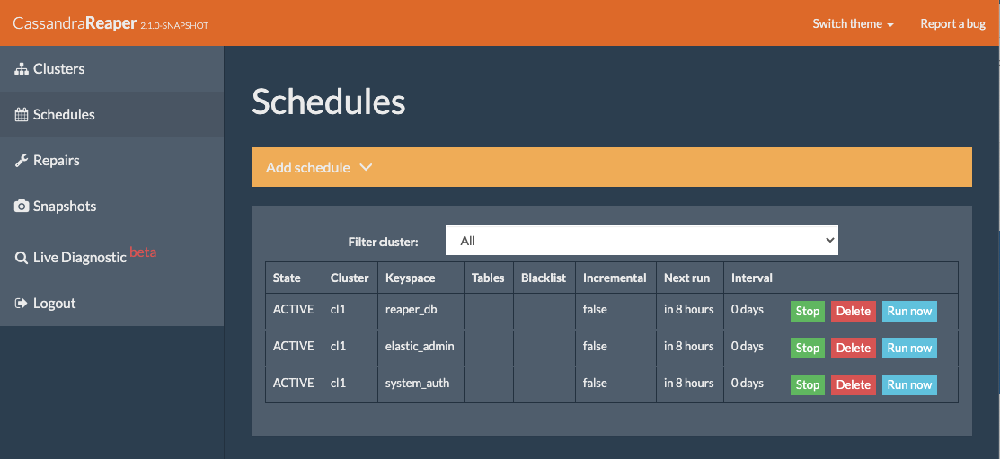
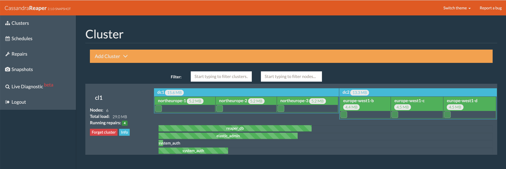

Mutli-datacenter deployment
===========================

With the Elassandra operator, you can connect Elassandra datacenter running in the same or distinct Kubernetes clusters.
The following chapter explains how to setup an Elassandra multi-datacenter deployment over the internet.

Kubernetes
----------

Here is instruction to prepare your Kubernetes cluster before deploying the Elassandra stack.

AKS
___

In order to create your Azure Kubernetes cluster, see the `Azure Quickstart <https://docs.microsoft.com/en-us/azure/aks/kubernetes-walkthrough>`_.

.. tip::

    To setup an AKS cluster with having a public IP address on each Kubernetes nodes, you need to install the following `Azure preview features
    <https://docs.microsoft.com/en-us/azure/aks/use-multiple-node-pools#assign-a-public-ip-per-node-for-your-node-pools-preview>`_.

    .. code::

        az extension add --name aks-preview
        az extension update --name aks-preview
        az feature register --name NodePublicIPPreview --namespace Microsoft.ContainerService

Create a resource group and regional AKS cluster with the Azure network plugin and a default nodepool based
on a `VirtualMachineScaleSets <https://docs.microsoft.com/en-us/rest/api/compute/virtualmachinescalesets>`_ that assigns
a public IP address to each virtual machine:

.. code::

    az group create -l ${AZURE_REGION} -n ${RESOURCE_GROUP_NAME}
    az aks create --name "${K8S_CLUSTER_NAME}" \
                  --resource-group ${RESOURCE_GROUP_NAME} \
                  --network-plugin azure \
                  --node-count 3 \
                  --node-vm-size Standard_D2_v3 \
                  --vm-set-type VirtualMachineScaleSets \
                  --output table \
                  --zone 1 2 3 \
                  --enable-node-public-ip
    az aks get-credentials --name "${K8S_CLUSTER_NAME}" --resource-group $RESOURCE_GROUP_NAME --output table

Unfortunately, AKS does not map VM's public IP address to the Kubernetes node external IP address, so the trick is to add these public IP addresses as a
kubernetes custom label ``elassandra.strapdata.com/public-ip`` to each nodes, here for the first Kubernetes node in our AKS cluster:

.. code::

    add_vmss_public_ip() {
       AKS_RG_NAME=$(az resource show --namespace Microsoft.ContainerService --resource-type managedClusters -g $RESOURCE_GROUP_NAME -n $K8S_CLUSTER_NAME | jq -r .properties.nodeResourceGroup)
       AKS_VMSS_INSTANCE=$(kubectl get nodes -o json | jq -r ".items[${1:-0}].metadata.name")
       PUBLIC_IP=$(az vmss list-instance-public-ips -g $AKS_RG_NAME -n ${AKS_VMSS_INSTANCE::-6} | jq -r ".[${1:-0}].ipAddress")
       kubectl label nodes --overwrite $AKS_VMSS_INSTANCE elassandra.strapdata.com/public-ip=$PUBLIC_IP
    }

    NODE_COUNT=$(kubectl get nodes --no-headers | wc -l)
    for i in $(seq 0 $((NODE_COUNT-1))); do
      add_vmss_public_ip $i
    done

As the result, you should have kubernetes nodes properly labeled with zone and public-ip:

.. code::

    kubectl get nodes -L failure-domain.beta.kubernetes.io/zone,elassandra.strapdata.com/public-ip
    NAME                                STATUS   ROLES   AGE   VERSION    ZONE           PUBLIC-IP
    aks-nodepool1-74300635-vmss000000   Ready    agent   54m   v1.15.11   westeurope-1   51.138.75.131
    aks-nodepool1-74300635-vmss000001   Ready    agent   54m   v1.15.11   westeurope-2   40.113.160.148
    aks-nodepool1-74300635-vmss000002   Ready    agent   54m   v1.15.11   westeurope-3   51.124.121.185

AKS StorageClass
................

Azure persistent volumes are bound to an availability zone, so we need to defined one storageClass per zone in our Kubernetes cluster,
and each Elassandra rack or statefulSet will be bound to the corresponding storageClass.
This is done here using the HELM chart strapdata/storageclass.

.. code::

    for z in 1 2 3; do
        helm install --name ssd-$AZURE_REGION-$z --namespace kube-system \
            --set parameters.kind="Managed" \
            --set parameters.cachingmode="ReadOnly" \
            --set parameters.storageaccounttype="StandardSSD_LRS" \
            --set provisioner="kubernetes.io/azure-disk" \
            --set zone="$AZURE_REGION-${z}" \
            --set nameOverride="ssd-$AZURE_REGION-$z" \
            strapdata/storageclass
    done

AKS Firewall rules
..................

Finally, you may need to authorize inbound Elassandra connections on the following TCP ports:

* Cassandra storage port (usually 7000 or 7001) for internode connections
* Cassandra native CQL port (usually 9042) for client to node connections.
* Elasticsearch HTTP port (usually 9200) for the Elasticsearch REST API.

Assuming you deploy an Elassandra datacenter respectively using ports 39000, 39001, and 39002 exposed to the internet, with no source IP address restrictions:

.. code::

    AKS_RG_NAME=$(az resource show --namespace Microsoft.ContainerService --resource-type managedClusters -g $RESOURCE_GROUP_NAME -n "${K8S_CLUSTER_NAME}" | jq -r .properties.nodeResourceGroup)
    NSG_NAME=$(az network nsg list -g $AKS_RG_NAME | jq -r .[0].name)
    az network nsg rule create \
        --resource-group $AKS_RG_NAME \
        --nsg-name $NSG_NAME \
        --name elassandra_inbound \
        --description "Elassandra inbound rule" \
        --priority 2000 \
        --access Allow \
        --source-address-prefixes Internet \
        --protocol Tcp \
        --direction Inbound \
        --destination-address-prefixes '*' \
        --destination-port-ranges 39000-39002

Your Kubernetes cluster is now ready to deploy an Elassandra datacenter accessible from the internet world.

GKE
___

Create a `Regional Kubernetes cluster <https://cloud.google.com/kubernetes-engine/docs/how-to/creating-a-regional-cluster>`_ on GCP:

.. code::

    gcloud container clusters create $K8S_CLUSTER_NAME \
      --region $GCLOUD_REGION \
      --project $GCLOUD_PROJECT \
      --machine-type "n1-standard-2" \
      --cluster-version=1.15 \
      --tags=$K8S_CLUSTER_NAME \
      --num-nodes "1"
    gcloud container clusters get-credentials $K8S_CLUSTER_NAME --region $GCLOUD_REGION --project $GCLOUD_PROJECT

Enable RBAC:

.. code::

    kubectl create clusterrolebinding cluster-admin-binding --clusterrole cluster-admin --user $(gcloud config get-value account)

CoreDNS installation
....................

GKE is provided with KubeDNS by default, which does not allows to configure host aliases required by our Kubernetes AddressTranslator.
So we need to install CoreDNS configured to import custom configuration (see `CoreDNS import plugin <https://coredns.io/plugins/import/>`_),
and configure KubeDNS with a stub domain to forward to CoreDNS.

.. code::

    helm install --name coredns --namespace=kube-system -f integ-test/gke/coredns-values.yaml stable/coredns

Where integ-test/gke/coredns-values.yaml is:

.. code::

    # Default values for coredns.
    # This is a YAML-formatted file.
    # Declare variables to be passed into your templates.

    image:
      repository: coredns/coredns
      tag: "1.6.9"
      pullPolicy: IfNotPresent

    replicaCount: 1

    resources:
      limits:
        cpu: 100m
        memory: 128Mi
      requests:
        cpu: 100m
        memory: 128Mi

    serviceType: "ClusterIP"

    prometheus:
      service:
        enabled: false
        annotations:
          prometheus.io/scrape: "true"
          prometheus.io/port: "9153"
      monitor:
        enabled: false
        additionalLabels: {}
        namespace: ""

    service:
      # clusterIP: ""
      # loadBalancerIP: ""
      # externalTrafficPolicy: ""
      annotations:
        prometheus.io/scrape: "true"
        prometheus.io/port: "9153"

    serviceAccount:
      create: false
      # The name of the ServiceAccount to use
      # If not set and create is true, a name is generated using the fullname template
      name:

    rbac:
      # If true, create & use RBAC resources
      create: true
      # If true, create and use PodSecurityPolicy
      pspEnable: false
      # The name of the ServiceAccount to use.
      # If not set and create is true, a name is generated using the fullname template
      # name:

    # isClusterService specifies whether chart should be deployed as cluster-service or normal k8s app.
    isClusterService: true

    # Optional priority class to be used for the coredns pods. Used for autoscaler if autoscaler.priorityClassName not set.
    priorityClassName: ""

    # Default zone is what Kubernetes recommends:
    # https://kubernetes.io/docs/tasks/administer-cluster/dns-custom-nameservers/#coredns-configmap-options
    servers:
      - zones:
          - zone: .
        port: 53
        plugins:
          - name: errors
          # Serves a /health endpoint on :8080, required for livenessProbe
          - name: health
            configBlock: |-
              lameduck 5s
          # Serves a /ready endpoint on :8181, required for readinessProbe
          - name: ready
          # Required to query kubernetes API for data
          - name: kubernetes
            parameters: cluster.local in-addr.arpa ip6.arpa
            configBlock: |-
              pods insecure
              fallthrough in-addr.arpa ip6.arpa
              ttl 30
          # Serves a /metrics endpoint on :9153, required for serviceMonitor
          - name: prometheus
            parameters: 0.0.0.0:9153
          - name: forward
            parameters: . /etc/resolv.conf
          - name: cache
            parameters: 30
          - name: loop
          - name: reload
          - name: loadbalance
          - name: import
            parameters: "custom/*.override"

    # Complete example with all the options:
    # - zones:                 # the `zones` block can be left out entirely, defaults to "."
    #   - zone: hello.world.   # optional, defaults to "."
    #     scheme: tls://       # optional, defaults to "" (which equals "dns://" in CoreDNS)
    #   - zone: foo.bar.
    #     scheme: dns://
    #     use_tcp: true        # set this parameter to optionally expose the port on tcp as well as udp for the DNS protocol
    #                          # Note that this will not work if you are also exposing tls or grpc on the same server
    #   port: 12345            # optional, defaults to "" (which equals 53 in CoreDNS)
    #   plugins:               # the plugins to use for this server block
    #   - name: kubernetes     # name of plugin, if used multiple times ensure that the plugin supports it!
    #     parameters: foo bar  # list of parameters after the plugin
    #     configBlock: |-      # if the plugin supports extra block style config, supply it here
    #       hello world
    #       foo bar

    # expects input structure as per specification https://kubernetes.io/docs/reference/generated/kubernetes-api/v1.11/#affinity-v1-core
    # for example:
    #   affinity:
    #     nodeAffinity:
    #      requiredDuringSchedulingIgnoredDuringExecution:
    #        nodeSelectorTerms:
    #        - matchExpressions:
    #          - key: foo.bar.com/role
    #            operator: In
    #            values:
    #            - master
    affinity: {}

    # Node labels for pod assignment
    # Ref: https://kubernetes.io/docs/user-guide/node-selection/
    nodeSelector: {}

    # expects input structure as per specification https://kubernetes.io/docs/reference/generated/kubernetes-api/v1.11/#toleration-v1-core
    # for example:
    #   tolerations:
    #   - key: foo.bar.com/role
    #     operator: Equal
    #     value: master
    #     effect: NoSchedule
    tolerations: []

    # https://kubernetes.io/docs/tasks/run-application/configure-pdb/#specifying-a-poddisruptionbudget
    podDisruptionBudget: {}

    # configure custom zone files as per https://coredns.io/2017/05/08/custom-dns-entries-for-kubernetes/
    zoneFiles: []
    #  - filename: example.db
    #    domain: example.com
    #    contents: |
    #      example.com.   IN SOA sns.dns.icann.com. noc.dns.icann.com. 2015082541 7200 3600 1209600 3600
    #      example.com.   IN NS  b.iana-servers.net.
    #      example.com.   IN NS  a.iana-servers.net.
    #      example.com.   IN A   192.168.99.102
    #      *.example.com. IN A   192.168.99.102

    # optional array of extra volumes to create
    extraVolumes:
      - name: custom-config-volume
        configMap:
          name: coredns-custom
    # - name: some-volume-name
    #   emptyDir: {}
    # optional array of mount points for extraVolumes
    extraVolumeMounts:
      - name: custom-config-volume
        mountPath: /etc/coredns/custom
    # - name: some-volume-name
    #   mountPath: /etc/wherever

    # optional array of secrets to mount inside coredns container
    # possible usecase: need for secure connection with etcd backend
    extraSecrets: []
    # - name: etcd-client-certs
    #   mountPath: /etc/coredns/tls/etcd
    # - name: some-fancy-secret
    #   mountPath: /etc/wherever

    # Custom labels to apply to Deployment, Pod, Service, ServiceMonitor. Including autoscaler if enabled.
    customLabels: {}

    ## Configue a cluster-proportional-autoscaler for coredns
    # See https://github.com/kubernetes-incubator/cluster-proportional-autoscaler
    autoscaler:
      # Enabled the cluster-proportional-autoscaler
      enabled: false

      # Number of cores in the cluster per coredns replica
      coresPerReplica: 256
      # Number of nodes in the cluster per coredns replica
      nodesPerReplica: 16
      # Min size of replicaCount
      min: 0
      # Max size of replicaCount (default of 0 is no max)
      max: 0
      # Whether to include unschedulable nodes in the nodes/cores calculations - this requires version 1.8.0+ of the autoscaler
      includeUnschedulableNodes: false
      # If true does not allow single points of failure to form
      preventSinglePointFailure: true

      image:
        repository: k8s.gcr.io/cluster-proportional-autoscaler-amd64
        tag: "1.8.0"
        pullPolicy: IfNotPresent

      # Optional priority class to be used for the autoscaler pods. priorityClassName used if not set.
      priorityClassName: ""

      # expects input structure as per specification https://kubernetes.io/docs/reference/generated/kubernetes-api/v1.11/#affinity-v1-core
      affinity: {}

      # Node labels for pod assignment
      # Ref: https://kubernetes.io/docs/user-guide/node-selection/
      nodeSelector: {}

      # expects input structure as per specification https://kubernetes.io/docs/reference/generated/kubernetes-api/v1.11/#toleration-v1-core
      tolerations: []

      # resources for autoscaler pod
      resources:
        requests:
          cpu: "20m"
          memory: "10Mi"
        limits:
          cpu: "20m"
          memory: "10Mi"

      # Options for autoscaler configmap
      configmap:
        ## Annotations for the coredns-autoscaler configmap
        # i.e. strategy.spinnaker.io/versioned: "false" to ensure configmap isn't renamed
        annotations: {}

Once CoreDNS is installed, add a stub domain to forward request for domain **internal.strapdata.com**
to the CoreDNS service, and restart KubeDNS pods.
The **internal.strapdata.com** is just a dummy DNS domain used to resolve public IP addresses to Kubernetes nodes internal IP addresses.

.. code::

    COREDNS_SERVICE_IP=$(kubectl get  service -l k8s-app=coredns  -n kube-system -o jsonpath='{.items[0].spec.clusterIP}')
    KUBEDNS_STUB_DOMAINS="{\\\"internal.strapdata.com\\\": [\\\"$COREDNS_SERVICE_IP\\\"]}"
    kubectl patch configmap/kube-dns -n kube-system -p "{\"data\": {\"stubDomains\": \"$KUBEDNS_STUB_DOMAINS\"}}"
    kubectl delete pod -l k8s-app=coredns -n kube-system

GKE StorageClass
................

Google cloud persistent volumes are bound to an availability zone, so we need to defined one storageClass per zone in our Kubernetes cluster,
and each Elassandra rack or statefulSet will be bound to the corresponding storageClass.
This is done here using the HELM chart strapdata/storageclass.

.. code::

    for z in europe-west1-b europe-west1-c europe-west1-d; do
        helm install --name ssd-$z --namespace kube-system \
            --set parameters.type="pd-ssd" \
            --set provisioner="kubernetes.io/gce-pd" \
            --set zone=$z,nameOverride=ssd-$z \
            strapdata/storageclass
    done

GKE Firewall rules
..................

Finally, you may need to authorize inbound Elassandra connections on the following TCP ports:

* Cassandra storage port (usually 7000 or 7001) for internode connections
* Cassandra native CQL port (usually 9042) for client to node connections.
* Elasticsearch HTTP port (usually 9200) for the Elasticsearch REST API.

Assuming you deploy an Elassandra datacenter respectively using ports 39000, 39001, and 39002 exposed to the internet, with no source IP address restrictions,
and Kubernetes nodes are properly tagged:

.. code::

    VPC_NETWORK=$(gcloud container clusters describe $K8S_CLUSTER_NAME --region $GCLOUD_REGION --format='value(network)')
    NODE_POOLS_TARGET_TAGS=$(gcloud container clusters describe $K8S_CLUSTER_NAME --region $GCLOUD_REGION --format='value[terminator=","](nodePools.config.tags)' --flatten='nodePools[].config.tags[]' | sed 's/,\{2,\}//g')
    gcloud compute firewall-rules create "allow-elassandra-inbound" \
      --allow tcp:39000-39002 \
      --network="$VPC_NETWORK" \
      --target-tags="$NODE_POOLS_TARGET_TAGS" \
      --description="Allow elassandra inbound" \
      --direction INGRESS

Webhook in GKE private cluster
..............................

When Google configure the control plane for **private clusters**, they automatically configure VPC peering between your
Kubernetes cluster’s network and a separate Google managed project. In order to restrict what Google are able to access within your cluster,
the firewall rules configured restrict access to your Kubernetes pods. This means that in order to use the webhook component
with a GKE private cluster, you must configure an additional firewall rule to allow the GKE control plane access to your webhook pod.

You can read more information on how to add firewall rules for the GKE control plane nodes in the GKE docs.
Alternatively, you can disable the hooks by setting webhookEnabled=false in your datacenter spec.

.. code::

    VPC_NETWORK=$(gcloud container clusters describe $K8S_CLUSTER_NAME --region $GCLOUD_REGION --format='value(network)')
    MASTER_IPV4_CIDR_BLOCK=$(gcloud container clusters describe $K8S_CLUSTER_NAME --region $GCLOUD_REGION --format='value(clusterIpv4Cidr)')
    NODE_POOLS_TARGET_TAGS=$(gcloud container clusters describe $K8S_CLUSTER_NAME --region $GCLOUD_REGION --format='value[terminator=","](nodePools.config.tags)' --flatten='nodePools[].config.tags[]' | sed 's/,\{2,\}//g')

    gcloud compute firewall-rules create "allow-apiserver-to-admission-webhook-443" \
      --allow tcp:8443 \
      --network="$VPC_NETWORK" \
      --source-ranges="$MASTER_IPV4_CIDR_BLOCK" \
      --target-tags="$NODE_POOLS_TARGET_TAGS" \
      --description="Allow apiserver access to admission webhook pod on port 443" \
      --direction INGRESS

AWS
___

Coming soon...

Operators
---------

Elassandra Operator
___________________

Install the Elassandra operator in the default namespace:

.. code::

    helm install --namespace default --name elassop --wait strapdata/elassandra-operator

ExternalDNS
___________

The `ExternalDNS <https://github.com/kubernetes-sigs/external-dns>`_ is used to automatically update your DNS zone and
create an A record for the Cassandra broadcast IP addresses. You can use it with a public or a private DNS zone.

In the following setup, we will use a DNS zone hosted on Azure, but you can use any other DNS provider supported by External DNS.

.. code::

    helm install --name my-externaldns --namespace default \
        --set logLevel="debug" \
        --set rbac.create=true \
        --set policy="sync",txtPrefix=$(kubectl config current-context)\
        --set sources[0]="service",sources[1]="ingress",sources[2]="crd" \
        --set crd.create=true,crd.apiversion="externaldns.k8s.io/v1alpha1",crd.kind="DNSEndpoint" \
        --set provider="azure" \
        --set azure.secretName="$AZURE_DNS_SECRET_NAME",azure.resourceGroup="$AZURE_DNS_RESOURCE_GROUP" \
        --set azure.tenantId="$AZURE_DNS_TENANT_ID",azure.subscriptionId="$AZURE_SUBSCRIPTION_ID" \
        --set azure.aadClientId="$AZURE_DNS_CLIENT_ID",azure.aadClientSecret="$AZURE_DNS_CLIENT_SECRET" \
        stable/external-dns

Key points:

* Watch for Kubernetes services, ingress, and the DNSEndpoint CRD published by the Elassandra operator when externalDns.enabled=true.
* With ``policy=sync``, we need to setup a txtPrefix per Kubernetes cluster in order to avoid update conflict between
  clusters using the same DNS zone.

CoreDNS
_______

The Kubernetes CoreDNS is used for two reasons:

* Resolve DNS name of you DNS zone from inside the Kubernetes cluster using DNS forwarders.
* Reverse resolution of the broadcast Elassandra public IP addresses to Kubernetes nodes private IP.

You can deploy the CodeDNS custom configuration with the strapdata coredns-forwarder HELM chart to basically install (or replace)
the coredns-custom configmap, and restart coreDNS pods.

If your Kubernetes nodes have the ExternalIP set (like GKE), prepare the coreDNS with this command:

.. code::

      HOST_ALIASES=$(kubectl get nodes -o custom-columns='INTERNAL-IP:.status.addresses[?(@.type=="InternalIP")].address,EXTERNAL-IP:.status.addresses[?(@.type=="ExternalIP")].address' --no-headers |\
      awk '{ gsub(/\./,"-",$2); printf("--set nodes.hosts[%d].name=%s,nodes.hosts[%d].value=%s ",NR-1, $2, NR-1, $1); }')

If your Kubernetes nodes does not have the ExternalIP set (like AKS), public node IP address should be available through the custom label ``elassandra.strapdata.com/public-ip``.

.. code::

      HOST_ALIASES=$(kubectl get nodes -o custom-columns='INTERNAL-IP:.status.addresses[?(@.type=="InternalIP")].address,PUBLIC-IP:.metadata.labels.kubernetes\.strapdata\.com/public-ip' --no-headers |\
      awk '{ gsub(/\./,"-",$2); printf("--set nodes.hosts[%d].name=%s,nodes.hosts[%d].value=%s ",NR-1, $2, NR-1, $1); }')

Then configure the CoreDNS custom config with your DNS name servers, this is Azure name servers in the following example:

.. code::

      kubectl delete configmap --namespace kube-system coredns-custom
      helm install $HELM_DEBUG --name coredns-forwarder --namespace kube-system \
          --set forwarders.domain="${DNS_DOMAIN}" \
          --set forwarders.hosts[0]="40.90.4.8" \
          --set forwarders.hosts[1]="64.4.48.8" \
          --set forwarders.hosts[2]="13.107.24.8" \
          --set forwarders.hosts[3]="13.107.160.8" \
          --set nodes.domain=internal.strapdata.com \
          $HOST_ALIASES \
          strapdata/coredns-forwarder

Restart CoreDNS pods to reload our configuration, but this depends on coreDNS deployment labels !

On AKS:

.. code::

    kubectl delete pod --namespace kube-system -l k8s-app=kube-dns

On GKE:

.. code::

    kubectl delete pod --namespace kube-system -l k8s-app=coredns

Check the CoreDNS custom configuration:

.. code::

    kubectl get configmap -n kube-system coredns-custom -o yaml
    apiVersion: v1
    data:
      dns.server: |
        test.strapkube.com:53 {
            errors
            cache 30
            forward test.strapkube.com 40.90.4.8 64.4.48.8 13.107.24.8 13.107.160.8
        }
      hosts.override: |
        hosts nodes.hosts internal.strapdata.com {
            10.132.0.57 146-148-117-125.internal.strapdata.com 146-148-117-125
            10.132.0.58 35-240-56-87.internal.strapdata.com 35-240-56-87
            10.132.0.56 34-76-40-251.internal.strapdata.com 34-76-40-251
            fallthrough
        }
    kind: ConfigMap
    metadata:
      creationTimestamp: "2020-06-26T16:45:52Z"
      name: coredns-custom
      namespace: kube-system
      resourceVersion: "6632"
      selfLink: /api/v1/namespaces/kube-system/configmaps/coredns-custom
      uid: dca59c7d-6503-48c1-864f-28ae46319725

Deploy a dnsutil pod:

.. code::

    cat <<EOF | kubectl apply -f -
    apiVersion: v1
    kind: Pod
    metadata:
      name: dnsutils
      namespace: default
    spec:
      containers:
      - name: dnsutils
        image: gcr.io/kubernetes-e2e-test-images/dnsutils:1.3
        command:
          - sleep
          - "3600"
        imagePullPolicy: IfNotPresent
      restartPolicy: Always
    EOF

Test resolution of public IP names to internal Kubernetes node IP address:

.. code::

    kubectl exec -ti dnsutils -- nslookup 146-148-117-125.internal.strapdata.com
    Server:		10.19.240.10
    Address:	10.19.240.10#53

    Name:	146-148-117-125.internal.strapdata.com
    Address: 10.132.0.57

.. _traefik-setup:

Traefik
_______

Deploy a Traefik ingress controller in order to access to web user interfaces for the following components:

* Cassandra Reaper
* Kibana
* Prometheus Server
* Prometheus Alert Manager
* Grafana

Here is simple Traefik deployment where TRAEFIK_FQDN=traefik-kube1.$DNS_DOMAIN:

.. code::

    helm install --name traefik --namespace kube-system \
        --set rbac.enabled=true \
        --set dashboard.enabled=true,dashboard.domain=dashboard.${TRAEFIK_FQDN} \
        --set service.annotations."external-dns\.alpha\.kubernetes\.io/hostname"="*.${TRAEFIK_FQDN}" \
        stable/traefik

The externalDns annotation automatically publish the public IP of the Traefik ingress controller in our DNS zone.
To avoid conflict between Kubernetes cluster using the same DNS zone, the TRAEFIK_FQDN variable must
be the unique traefik FQDN in our DNS zone (example: traefik-kube1.my.domain.com)

.. warning::

    Of course, this Traefik setup is not secure, an it's up to you to setup encryption and restrict access to those resources.

Multi-datacenter setup
----------------------

Deploy dc1 on kube1
___________________

Deploy the first datacenter **dc1** of the Elassandra cluster **cl1** in the Kubernetes cluster **kube1**,
with Kibana and Cassandra Reaper available through the Traefik ingress controller.

.. code::

    helm install --namespace default --name "default-cl1-dc1" \
        --set dataVolumeClaim.storageClassName="ssd-{zone}" \
        --set cassandra.sslStoragePort="39000" \
        --set cassandra.nativePort="39001" \
        --set elasticsearch.httpPort="39002" \
        --set elasticsearch.transportPort="39003" \
        --set jvm.jmxPort="39004" \
        --set jvm.jdb="39005" \
        --set prometheus.port="39006" \
        --set replicas="3" \
        --set networking.hostNetworkEnabled=true \
        --set networking.externalDns.enabled=true \
        --set networking.externalDns.domain=${DNS_DOMAIN} \
        --set networking.externalDns.root=cl1-dc1 \
        --set kibana.enabled="true",kibana.spaces[0].ingressAnnotations."kubernetes\.io/ingress\.class"="traefik",kibana.spaces[0].ingressSuffix=kibana.${TRAEFIK_FQDN} \
        --set reaper.enabled="true",reaper.ingressAnnotations."kubernetes\.io/ingress\.class"="traefik",reaper.ingressHost=reaper.${TRAEFIK_FQDN} \
        --wait strapdata/elassandra-datacenter

Key points:

* The storageClass must exist in your Kubernetes cluster, default is the default storage class on Microsoft Azure.
* Because ``hostNetwork`` is enabled, you need to properly choose TCP ports to avoid conflict on the Kubernetes nodes.
* The env variable **TRAEFIK_FQDN** must be the public FQDN of your traefik deployment, traefik-kube1.$DNS_DOMAIN in our example.

Wait for the datacenter **dc1** to be ready:

.. code::

    edctl watch-dc --context kube1 -n elassandra-cl1-dc1 -ns default --health GREEN

Once your Elassandra datacenter is ready, check that you can reach the datacenter over the internet.
Get the Elassandra cluster root CA certificate and Cassandra admin password:

.. code::

    kubectl get secret elassandra-cl1-ca-pub --context kube1 -n default -o jsonpath='{.data.cacert\.pem}' | base64 -D > cl1-cacert.pem
    CASSANDRA_ADMIN_PASSWORD=$(kb get secret elassandra-cl1 --context kube1 -o jsonpath='{.data.cassandra\.admin_password}' | base64 -D)

Check your Elassandra datacenter:

.. code::

    SSL_CERTFILE=cl1-cacert.pem bin/cqlsh --ssl -u admin -p $CASSANDRA_ADMIN_PASSWORD cassandra-cl1-dc1-0-0.test.strapkube.com 39001
    Connected to cl1 at cassandra-cl1-dc1-0-0.test.strapkube.com:39001.
    [cqlsh 5.0.1 | Cassandra 3.11.6.1 | CQL spec 3.4.4 | Native protocol v4]
    Use HELP for help.
    admin@cqlsh>

Check the Elasticsearch cluster status:

.. code::

    curl -k --user admin:$CASSANDRA_ADMIN_PASSWORD "https://cassandra-cl1-dc1-0-0.test.strapkube.com:39002/_cluster/state?pretty"
    {
      "cluster_name" : "cl1",
      "cluster_uuid" : "8bbfeef1-6112-4509-0000-000000000000",
      "version" : 2925,
      "state_uuid" : "Pp36o9m9QU-AtYm8FepEHA",
      "master_node" : "8bbfeef1-6112-4509-0000-000000000000",
      "blocks" : { },
      "nodes" : {
        "8bbfeef1-6112-4509-0000-000000000000" : {
          "name" : "20.54.72.64",
          "status" : "ALIVE",
          "ephemeral_id" : "8bbfeef1-6112-4509-0000-000000000000",
          "transport_address" : "10.240.0.4:9300",
          "attributes" : {
            "rack" : "northeurope-1",
            "dc" : "dc1"
          }
        },
        "3a246ac2-1a0a-4f6e-0001-000000000000" : {
          "name" : "40.113.33.9",
          "status" : "ALIVE",
          "ephemeral_id" : "3a246ac2-1a0a-4f6e-0001-000000000000",
          "transport_address" : "10.240.0.35:9300",
          "attributes" : {
            "rack" : "northeurope-2",
            "dc" : "dc1"
          }
        },
        "ff8f0776-97cd-47a3-0002-000000000000" : {
          "name" : "20.54.80.104",
          "status" : "ALIVE",
          "ephemeral_id" : "ff8f0776-97cd-47a3-0002-000000000000",
          "transport_address" : "10.240.0.66:9300",
          "attributes" : {
            "rack" : "northeurope-3",
            "dc" : "dc1"
          }
        }
      },
      "metadata" : {
        "version" : 0,
        "cluster_uuid" : "8bbfeef1-6112-4509-0000-000000000000",
        "templates" : { },
        "indices" : { },
        "index-graveyard" : {
          "tombstones" : [ ]
        }
      },
      "routing_table" : {
        "indices" : { }
      },
      "routing_nodes" : {
        "unassigned" : [ ],
        "nodes" : {
          "8bbfeef1-6112-4509-0000-000000000000" : [ ]
        }
      },
      "snapshots" : {
        "snapshots" : [ ]
      },
      "restore" : {
        "snapshots" : [ ]
      },
      "snapshot_deletions" : {
        "snapshot_deletions" : [ ]
      }
    }

Once started, Kibana and Cassandra Reaper should be available in **kube1** at :

* http://kibana-kibana.traefik-kube1.$DNS_DOMAIN/
* http://reaper.traefik-kube1.$DNS_DOMAIN/webui

If the Prometheus Operator is deployed, you should get web user interfaces at:

* http://prometheus.traefik-kube1.$DNS_DOMAIN/
* http://alertmanager.traefik-kube1.$DNS_DOMAIN/
* http://grafana.traefik-kube1.$DNS_DOMAIN/login

For Kibana and Cassandra reaper, kibana and admin passwords are respectively stored in the Kubernetes secrets **elassandra-cl1-kibana** and **elassandra-cl1-dc1-reaper** in
the Elassandra datacenter namespace.

.. code::

    KIBANA_PASSWORD=$(kb get secret elassandra-cl1-kibana --context kube1 -o jsonpath='{.data.kibana\.kibana_password}' | base64 -D)
    REAPER_ADMIN_PASSWORD=$(kb get secret elassandra-cl1-dc1-reaper --context kube1 -o jsonpath='{.data.password}' | base64 -D)

Here is the Elasticsearch cluster state from the Kibana devtool:

.. image:: ./images/kibana-cluster-state.png

Here the Cassandra Reaper UI with our registered Cassandra cluster:

Deploy dc2 on kube2
___________________

Once the Elassandra datacenter **dc1** is ready, you can deploy the datacenter **dc2** in the Kubernetes **kube2**.

First of all, copy the following Elassandra cluster secrets from the Kubernetes cluster **kube1** and
namespace **default**, into the Kubernetes cluster **kube2** namespace **default** (See the Security section for more information about these secrets):

* elassandra-cl1-dc1 (cluster passwords)
* elassandra-cl1-dc1-ca-pub (cluster root CA)
* elassandra-cl1-dc2-ca-key (cluster root CA key)
* elassandra-cl1-kibana (cluster kibana passwords)

.. code::

    for s in elassandra-cl1 elassandra-cl1-ca-pub elassandra-cl1-ca-key elassandra-cl1-kibana; do
        kubectl get secret $s --context kube1 --export -n default -o yaml | kubectl apply --context gke_strapkube1_europe-west1_kube2 -n default -f -
    done

.. tip::

    These Elassandra cluster-wide secrets does not include any ownerReference <https://kubernetes.io/docs/concepts/workloads/controllers/garbage-collection/>`_
    and won't be deleted when deleting the Elassandra datacenter because they could be used by another datacenter.
    So, it's up to you to properly delete these secrets when deleting an Elassandra cluster.

Deploy the datacenter **dc2** of the Elassandra cluster **cl1** in the Kubernetes cluster **cluster2**, with the following network settings:

.. code::

    helm install --namespace default --name "default-cl1-dc2" \
        --set dataVolumeClaim.storageClassName="ssd-{zone}" \
        --set cassandra.sslStoragePort="39000" \
        --set cassandra.nativePort="39001" \
        --set elasticsearch.httpPort="39002" \
        --set elasticsearch.transportPort="39003" \
        --set jvm.jmxPort="39004" \
        --set jvm.jdb="39005" \
        --set prometheus.port="39006" \
        --set replicas="3" \
        --set cassandra.remoteSeeds[0]=cassandra-cl1-dc1-0-0.${DNS_DOMAIN} \
        --set networking.hostNetworkEnabled=true \
        --set networking.externalDns.enabled=true \
        --set networking.externalDns.domain=${DNS_DOMAIN} \
        --set networking.externalDns.root=cl1-dc2 \
        --set kibana.enabled="true",kibana.spaces[0].ingressAnnotations."kubernetes\.io/ingress\.class"="traefik",kibana.spaces[0].ingressSuffix=kibana.${TRAEFIK_FQDN} \
        --set reaper.enabled="true",reaper.ingressAnnotations."kubernetes\.io/ingress\.class"="traefik",reaper.ingressHost=reaper.${TRAEFIK_FQDN} \
        --wait strapdata/elassandra-datacenter

Key points :

* Storage class must be defined in the Kubernetes cluster to match **ssd-{zone}**.
* The ``cassandra.remoteSeeds`` array must include the DNS name of a seed nodes in **dc1**.
* The ``networking.externalDns.root`` must be different from the **dc1** to avoid DNS name conflict, and you can include namespace or whatever in your naming plan.
* The **TRAEFIK_FQDN** env variable must point to the traefik public FQDN in the Kubernetes cluster **kube2**.

Wait for the datacenter **dc2** to be ready:

.. code::

    edctl watch-dc --context gke_strapkube1_europe-west1_kube2 -n elassandra-cl1-dc2 -ns default --replicas 3 --health GREEN
    19:29:20.254 [main] INFO  i.m.context.env.DefaultEnvironment.<init>:210 Established active environments: [cli]
    Waiting elassandra datacenter context=gke_strapkube1_europe-west1_kube2 name=elassandra-cl1-dc2 namespace=default health=GREEN timeout=600s
    19:29:21 ADDED: elassandra-cl1-dc2 phase=RUNNING heath=GREEN replicas=3 reaper=false cqlStatus=NOT_STARTED managedKeyspaces=[]
    done 143ms

The second datacenter has never bootstrapped, so nodes are started with auto_bootstrap=false.
Before streaming the Cassandra data, you now need to adjust the replication factor for the following keyspaces:

* system_distributed
* system_traces
* system_auth
* elastic_admin (if elasticsearch is enabled).
* any user keyspace that you want to replicate in **dc2**, *foo* in the provided example.

This is done with the following Elassandra task deployed on **dc1** (Kubernetes cluster **cluster1**):

.. code::

    cat <<EOF | kubectl apply --context kube1 -f -
    apiVersion: elassandra.strapdata.com/v1beta1
    kind: ElassandraTask
    metadata:
      name: replication-add-$$
      namespace: default
    spec:
      cluster: "cl1"
      datacenter: "dc1"
      replication:
        action: ADD
        dcName: "dc2"
        dcSize: 3
        replicationMap:
          reaper_db: 3
          foo: 1
    EOF
    edctl watch-task --context kube1 -n replication-add-573 -ns default --phase SUCCEED
    19:54:04.505 [main] INFO  i.m.context.env.DefaultEnvironment.<init>:210 Established active environments: [cli]
    Watching elassandra task context=kube1 name=replication-add-573 namespace=default phase=SUCCEED timeout=600s
    "19:54:06 ADDED: replication-add-573 phase=WAITING
    "19:55:02 MODIFIED: replication-add-573 phase=SUCCEED
    done 56772ms

Then on **dc2**, run a rebuild task to stream data from **dc1** and wait for termination:

.. code::

    cat <<EOF | kubectl apply --context gke_strapkube1_europe-west1_kube2 -f -
    apiVersion: elassandra.strapdata.com/v1beta1
    kind: ElassandraTask
    metadata:
      name: rebuild-dc2-$$
      namespace: default
    spec:
      cluster: "cl1"
      datacenter: "dc2"
      rebuild:
        srcDcName: "dc1"
    EOF
    edctl watch-task --context gke_strapkube1_europe-west1_kube2 -n rebuild-dc2-573 -ns default --phase SUCCEED
    19:59:29.458 [main] INFO  i.m.context.env.DefaultEnvironment.<init>:210 Established active environments: [cli]
    Watching elassandra task context=gke_strapkube1_europe-west1_kube2 name=rebuild-dc2-573 namespace=default phase=SUCCEED timeout=600s
    "19:59:30 ADDED: rebuild-dc2-573 phase=SUCCEED
    done 49ms

If elasticsearch is enabled in **dc2**, you need to run restart Elassandra pods to update the Elasticsearch
cluster state since data have been populated by streaming data from **dc1**.

.. code::

    kubectl delete pod --namespace default -l app=elassandra,elassandra.strapdata.com/datacenter=dc2

Check the status of the Elassandra cluster running on AKS and GKE:

.. code::

    Datacenter: dc1
    ===============
    Status=Up/Down
    |/ State=Normal/Leaving/Joining/Moving
    --  Address          Load       Tokens       Owns    Host ID                               Rack
    UN  20.54.72.64      4.77 MiB   16           ?       8bbfeef1-6112-4509-0000-000000000000  northeurope-1
    UN  40.113.33.9      4.77 MiB   16           ?       3a246ac2-1a0a-4f6e-0001-000000000000  northeurope-2
    UN  20.54.80.104     4.75 MiB   16           ?       ff8f0776-97cd-47a3-0002-000000000000  northeurope-3
    Datacenter: dc2
    ===============
    Status=Up/Down
    |/ State=Normal/Leaving/Joining/Moving
    --  Address          Load       Tokens       Owns    Host ID                               Rack
    UN  34.76.40.251     3.65 MiB   16           ?       66d0eada-908a-407d-0000-000000000000  europe-west1-c
    UN  35.240.56.87     3.51 MiB   16           ?       6c578060-fc2b-4737-0002-000000000000  europe-west1-b
    UN  146.148.117.125  3.51 MiB   16           ?       84846161-944e-49e2-0001-000000000000  europe-west1-d

Finally, check the datacenter **dc2** is properly running on the Kubernetes cluster **kube2**:

.. code::

    SSL_CERTFILE=cl1-cacert.pem bin/cqlsh --ssl -u admin -p $CASSANDRA_ADMIN_PASSWORD cassandra-cl1-dc2-0-0.test.strapkube.com 39001
    Connected to cl1 at cassandra-cl2-dc1-0-0.test.strapkube.com:39001.
    [cqlsh 5.0.1 | Cassandra 3.11.6.1 | CQL spec 3.4.4 | Native protocol v4]
    Use HELP for help.
    admin@cqlsh>

.. code::

    curl -k --user admin:$CASSANDRA_ADMIN_PASSWORD "https://cassandra-cl1-dc2-0-0.test.strapkube.com:39002/_cluster/state?pretty"
    {
      "cluster_name" : "cl1",
      "cluster_uuid" : "8bbfeef1-6112-4509-0000-000000000000",
      "version" : 33,
      "state_uuid" : "0K-HIaLaR6qcQJNEbEF1lw",
      "master_node" : "66d0eada-908a-407d-0000-000000000000",
      "blocks" : { },
      "nodes" : {
        "84846161-944e-49e2-0001-000000000000" : {
          "name" : "146.148.117.125",
          "status" : "ALIVE",
          "ephemeral_id" : "84846161-944e-49e2-0001-000000000000",
          "transport_address" : "10.132.0.57:9300",
          "attributes" : {
            "rack" : "europe-west1-d",
            "dc" : "dc2"
          }
        },
        "66d0eada-908a-407d-0000-000000000000" : {
          "name" : "34.76.40.251",
          "status" : "ALIVE",
          "ephemeral_id" : "66d0eada-908a-407d-0000-000000000000",
          "transport_address" : "10.132.0.56:9300",
          "attributes" : {
            "rack" : "europe-west1-c",
            "dc" : "dc2"
          }
        },
        "6c578060-fc2b-4737-0002-000000000000" : {
          "name" : "35.240.56.87",
          "status" : "ALIVE",
          "ephemeral_id" : "6c578060-fc2b-4737-0002-000000000000",
          "transport_address" : "10.132.0.58:9300",
          "attributes" : {
            "rack" : "europe-west1-b",
            "dc" : "dc2"
          }
        }
      },
      "metadata" : {
        "version" : 5,
        "cluster_uuid" : "8bbfeef1-6112-4509-0000-000000000000",
        ...

Cassandra reaper now see the two datacenters:

Cleaning up
-----------

Uninstall an Elassandra datacenter:

.. code::

    helm delete --purge elassandra-cl1-dc1

Uninstall the Elassandra operator and remove CRDs:

.. code::

    helm delete --purge elassandra-operator
    kubectl delete crd elassandradatacenters.elassandra.strapdata.com elassandratasks.elassandra.strapdata.com
