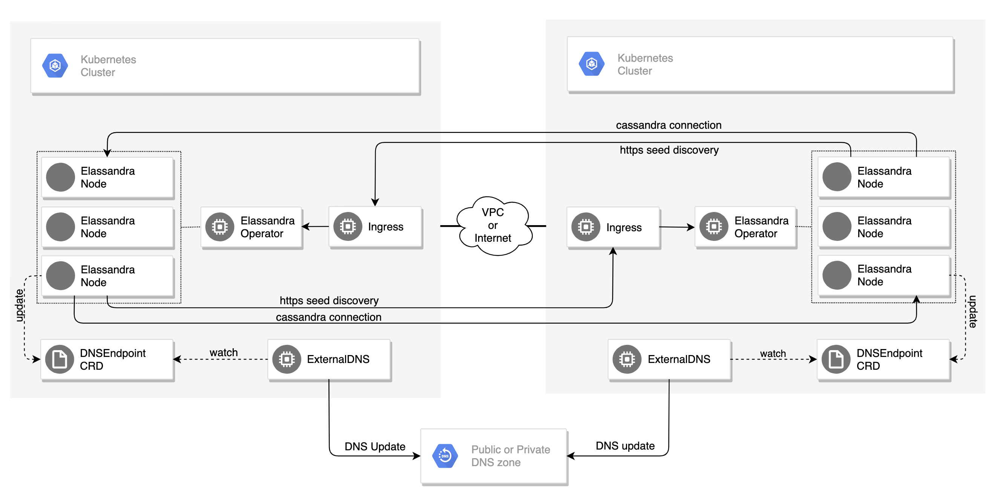

Overview
========

The Elassandra Kubernetes Operator automates the deployment and management of `Elassandra <https://github.com/strapdata/elassandra>`_
clusters in **multiple** `Kubernetes <https://kubernetes.io/>`_ clusters**. By reducing the complexity of running a Cassandra or
Elassandra cluster under Kubernetes, it gives you the flexibility to migrate your data to any Kubernetes cluster with
no downtime and the freedom to choose your cloud provider or run on-premise.

Elassandra Operator features:

* Manage one `Kubernetes StatefulSet <https://kubernetes.io/docs/concepts/workloads/controllers/statefulset/>`_ per Cassandra rack to ensure data consistency across cloud-provider availability zones.
* Manage multiple Elassandra/Cassandra datacenters in the same or different Kubernetes clusters, in one or multiple namespaces.
* Manage rolling configuration changes, rolling upgrade/downgrade of Elassandra.
* Scale up/down Elassandra datacenters.
* Park/Unpark Elassandra datacenters (and associated Kibana and Cassandra Reaper instances).
* Implements Elassandra tasks to add/remove datacenters from an Elassandra cluster.
* Deploy `Cassandra Reaper <https://cassandra-reaper.io/>`_ and register keyspaces to run continuous Cassandra repairs.
* Deploy multiple `Kibana <https://www.elastic.co/fr/products/kibana>`_ instances with a dedicated Elasticsearch index in Elassandra (Kibana spaces).
* Expose Elassandra metrics for the `Prometheus Operator <https://github.com/helm/charts/tree/master/stable/prometheus-operator>`_.
* Publish DNS names of Elassandra broadcast IP addresses using `ExternalDNS <https://github.com/kubernetes-sigs/external-dns>`_.
* Automatically generates SSL/TLS certificates and strong passwords stored as Kubernetes secrets (if not provided).
* Create Cassandra roles and automatically grants the desired permissions on Cassandra keyspaces.
* Depending on the number of running Elassandra nodes, automatically adjusts the Cassandra Replication Factor for managed keyspaces, repair and cleanup after scale up/down.
* Provide a java `AddressTranslator <https://docs.datastax.com/en/developer/java-driver/3.6/manual/address_resolution/>`_ for the Cassandra driver allowing to run applications in the same Kubernetes cluster as the Elassandra datacenter (similar to the [EC2MultiRegionAddressTranslator](https://docs.datastax.com/en/drivers/java/3.7/index.html?com/datastax/driver/core/policies/EC2MultiRegionAddressTranslator.html) but for any Kubernetes cluster).

Requirements
------------

* Kubernetes cluster 1.15 or newer.
* Kubernetes nodes must be properly synchronized with NTP.
* Kubernetes worker nodes must have labels matching ``failure-domain.beta.kubernetes.io/zone``.
* HELM version 2 for operator and datacenter deployment.
* `Prometheus-Operator <https://github.com/helm/charts/tree/master/stable/prometheus-operator>`_ to monitor your the Elassandra operator and Elassandra cluster.
* A Kubernetes `Ingress Controller <https://kubernetes.io/docs/concepts/services-networking/ingress-controllers/>`_ to expose Kibana, Cassandra Reaper user interface, and the Elassandra operator for cross kubernetes cluster discovery.
* `ExternalDNS <https://github.com/kubernetes-sigs/external-dns>`_ to expose Elassandra datacenters to the internet world.

How It works
------------

The Elassandra Operator extends the Kubernetes API by creating a Custom Resource Definition (CRD) defining a Cassandra/Elassandra datacenter
and creates a Kubernetes StatefulSet per Cassandra availability zone identified by the kubernetes label ``failure-domain.beta.kubernetes.io/zone``.

The Elassandra Operator can also deploy :
* One Cassandra Reaper pod per datacenter to achieve continuous Cassandra repair.
* Many Kibana deployment allowing to visualize data indexed in Elasticsearch and interact with Elasticsearch.

.. image:: ./images/elassandra-operator-overview.png

Once Elassandra pods are deployed and running, the Elassandra operator interacts with the Elassandra nodes through JMX, CQLSH and HTTP
to execute administrative tasks like Cassandra repair, cleanup or setup continuous repairs.
It also interact directly with the Elassandra container to properly manage keyspace replication factor and deploy Cassandra roles and associated permissions.

Multi-datacenter cluster
------------------------

The Elassandra operator can manage multiple Elassandra datacenters (or a Cassandra datacenter if Elasticsearch is disabled) in
one or multiple Kubernetes clusters. In order to connect multiple Elassandra datacenters, you can use the DNS names of seed nodes, or
use the operator to get IP addresses of seed nodes.

Using DNS names
_______________

Basically, seeds nodes are Elassandra pods with index 0 in each StatefulSet, and DNS names for these seed nodes are:

* From inside the Kubernetes cluster, seeds DNS names are in the form:

  .. code::

      elassandra-[clusterName]-[dcName]-[rackIndex]-0.elassandra-[clusterName]-[dcName]-[rackIndex].[namespace].svc

* From outside the Kubernetes cluster, when the externalDns publication is enabled in your datacenter spec, DNS names for
  pods are in the following form, where **podIndex=0** for seed nodes:

  .. code::

      cassandra-[externalDns.root]-[rackIndex]-[podIndex].[externalDns.domain]

When an Elassandra node restarts with another IP address, the Kubernetes internal DNS is automatically updated, and the
`ExternalDNS <https://github.com/kubernetes-sigs/external-dns>`_ operator also update your DNS zone.

In order to connect a datacenter **dc1** to another datacenter **dc2** in the Cassandra cluster **cl1**, you need to specify the remote seeds names in your datacenter spec.
For example, if dc1 and dc2 respectively running in namespaces **ns1** and **ns2** in the same kubernetes cluster, you would have the following spec on dc1:

.. code::

    remoteSeeds:
      - elassandra-cl1-dc2-0-0.elassandra-cl1-dc2-0.ns2.svc
      - elassandra-cl1-dc2-1-0.elassandra-cl1-dc2-1.ns2.svc
      - elassandra-cl1-dc2-2-0.elassandra-cl1-dc2-2.ns2.svc

If **dc1** and **dc2** are deployed in two Kubernetes clusters, you would have the following spec on **dc1**.
Of course, the ``externalDns.root`` must different in dc1 and dc2 to avoid DNS naming conflicts.

.. code::

    externalDns:
      root: dc1
      domain: my-domain.com
    remoteSeeds:
      - cassandra-dc2-0-0.my-domain.com
      - cassandra-dc2-1-0.my-domain.com
      - cassandra-dc2-2-0.my-domain.com

And on **dc2**:

.. code::

    externalDns:
      root: dc2
      domain: my-domain.com
    remoteSeeds:
      - cassandra-dc1-0-0.my-domain.com
      - cassandra-dc1-1-0.my-domain.com
      - cassandra-dc1-2-0.my-domain.com

Using the Elassandra operator
_____________________________

Elassandra nodes run a SeedProvider that can request multiple Elassandra operators to get seed node IP addresses for each datacenters.

The Elassandra operator HTTP endpoint **/seeds/{namespace}/{clusterName}/{dcName}** returns
the Cassandra RPC broadcast IP addresses of Elassandra seed pods, which are pods IP addresses by default.
If ``networking.hostNetworkEnabled=true`` or ``networking.hostPortEnabled=true`` in your Elassandra datacenter spec,
the Cassandra RPC broadcast address of an Elassandra pod running on the Kubernetes node will be :

* The Kubernetes node external-IP if available,
* or the IP address defined by the node label ``kubernetes.strapdata.com/public-ip`` if available,
* or the Kubernetes node internal IP address in last resort.

For example, if you run datacenter **dc1** in the cluster **cl1** in namespace **ns1**, you can connect to
a remote datacenter **dc2** deployed in namespace **ns2** with the following datacenter spec. Of course,
the elassandra-operator.my-domain.com must be properly resolved in your Kubernetes infrastructure.

.. code::

    remoteSeeders:
    - https://elassandra-operator.my-domain.com/seeds/ns2/cl1/dc2

